layout: true
  

`r paste0("
", params$event, " 

")`

---
class: center, middle

Ces slides en ligne : `r paste0("http://datactivist.coop/", params$slug)`

Sources : `r paste0("https://github.com/datactivist/", params$slug)`

Les productions de Datactivist sont librement réutilisables selon les termes de la licence [Creative Commons 4.0 BY-SA](https://creativecommons.org/licenses/by-sa/4.0/legalcode.fr).

 
 

---
class: inverse, center, middle

### Ces dix choses incroyables qui n'auraient pas existé sans l'open data

---
class: inverse, center, middle

# 1. Yuka

.center[]

---

---
## Yuka 

### 8,5 millions d'utilisateurs
### 2 millions de produits scannés chaque jour
### Top 10 des applis gratuites sur l'Appstore et le Playstore

---

[.center[]](https://fr.openfoodfacts.org/decouvrir)

---
class: inverse, center, middle

# 2. Startups d'État

---

## beta.gouv.fr

[.center[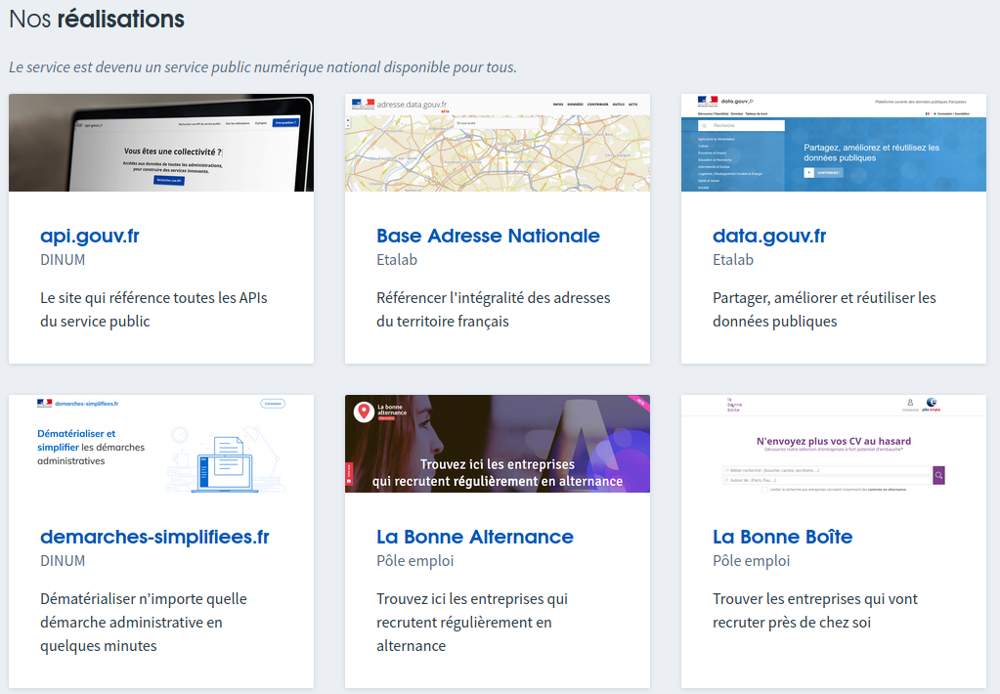]](https://beta.gouv.fr/startups)

---

## Au commencement était data.gouv.fr

.center[]

---
class: inverse, center, middle

# 3. Pokemon go 

.center[]

---

[.center[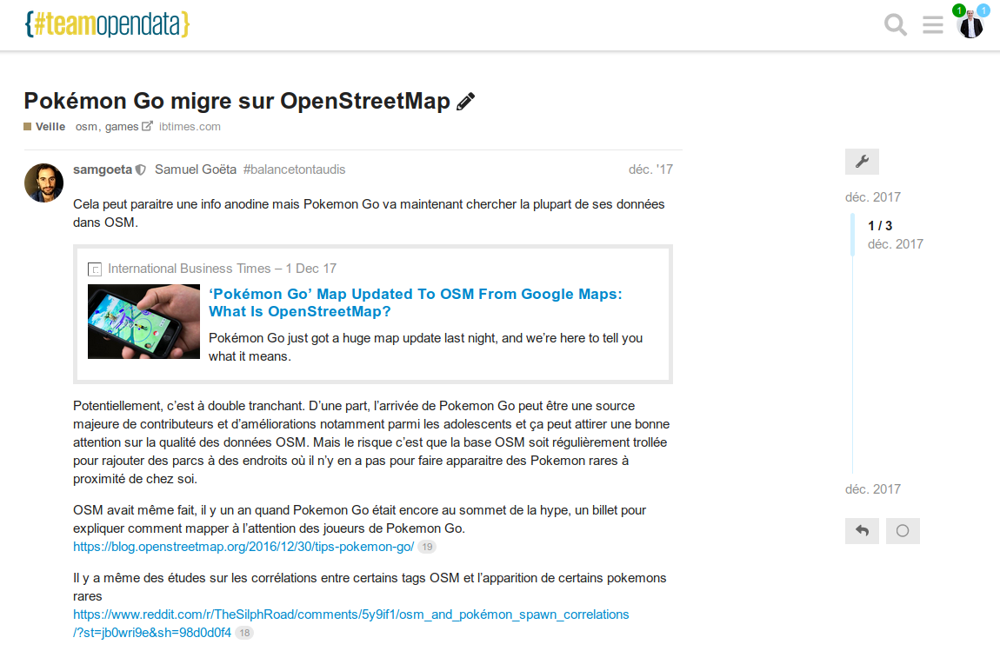]](https://teamopendata.org/t/pokemon-go-migre-sur-openstreetmap/113)

---

## Google Maps

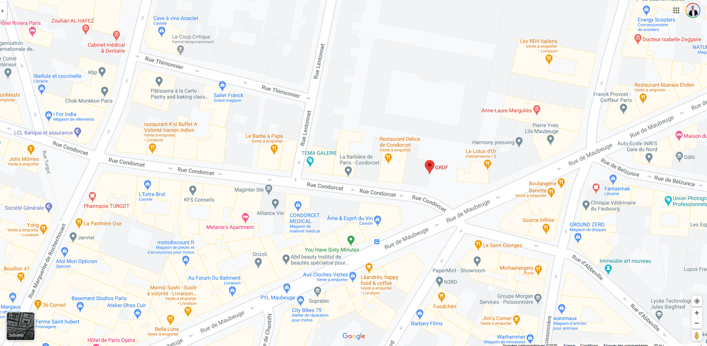

---
## OpenStreetMap

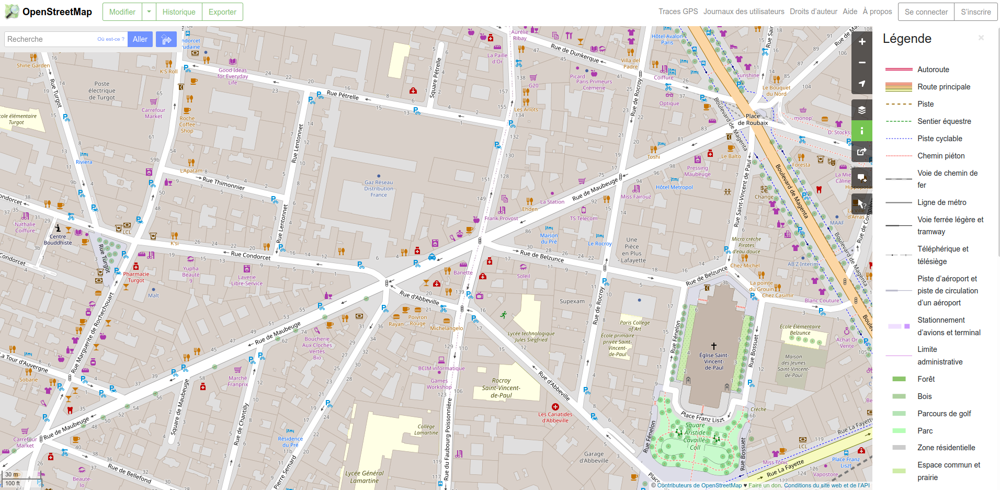

---
## OpenStreetMap

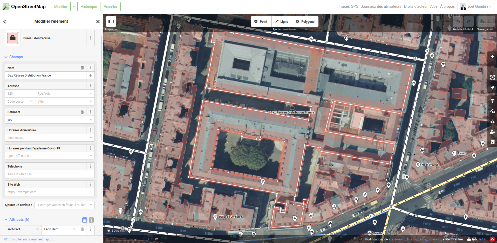

---
## OpenStreetMap

[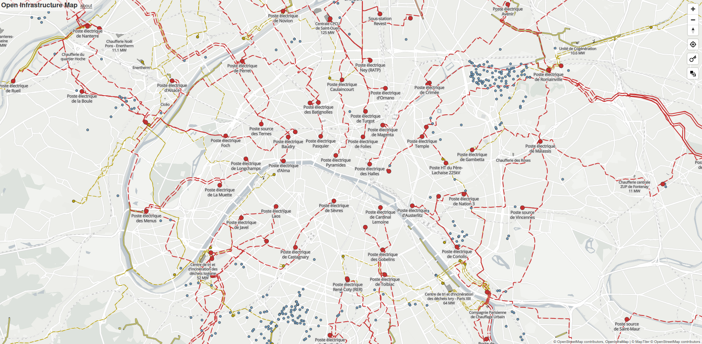](https://openinframap.org/#11.9/48.86066/2.33825/O,P)

---
class: inverse, center, middle

# 4. Une carte de la pollution de l'air dans les écoles

---

## Merci AirParif !

---

---
class: inverse, center, middle

# 5. Les applis de mobilité

---
## Les applis de mobilité

.center[.reduite[]]

---
## Les applis de mobilité

.center[.reduite[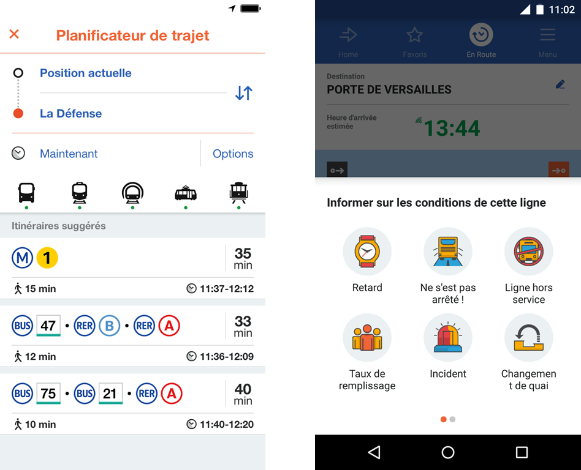]]

---
## Les applis de mobilité

.center[.reduite[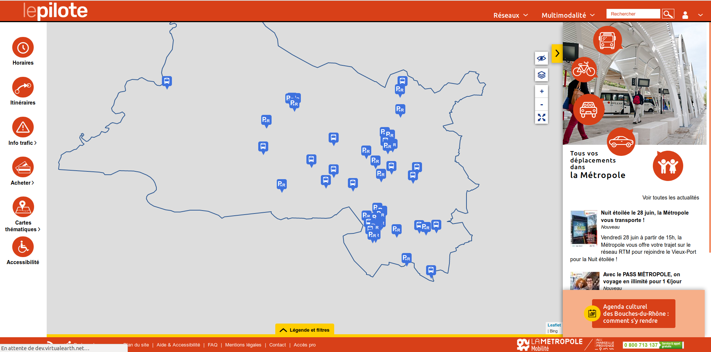]]

---
## Les applis de mobilité

.center[.reduite[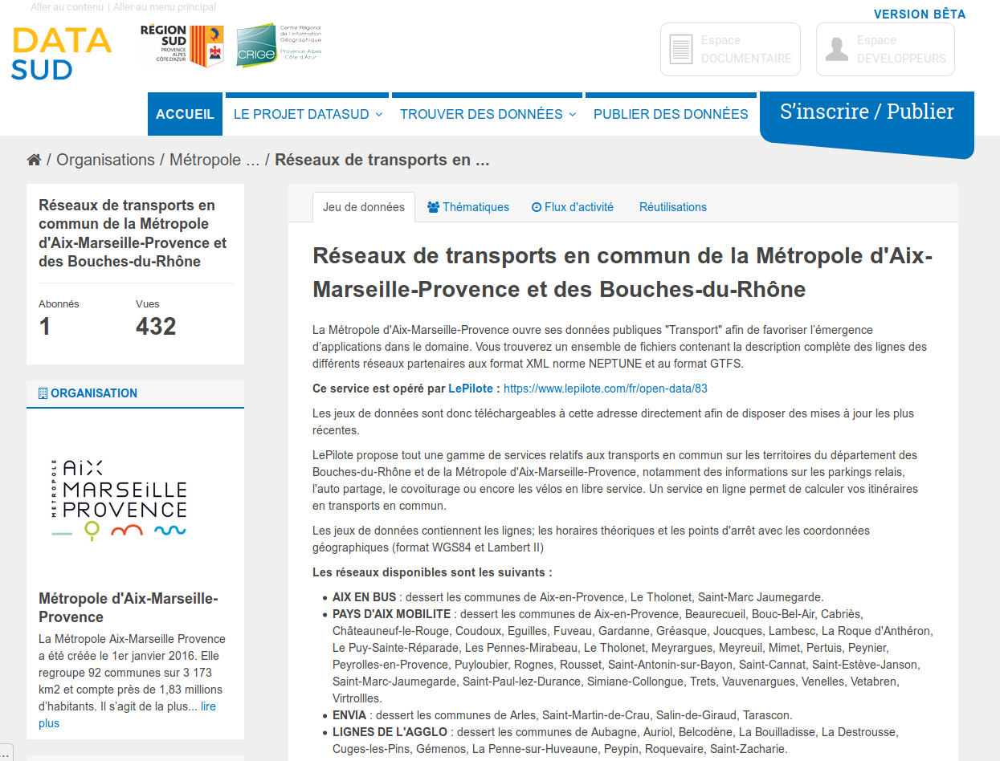]]

---
class: inverse, center, middle

# 6. Les prix de l'immobilier 

---

[.center[]](https://www.meilleursagents.com/prix-immobilier/dvf/)

---
## Une réutilisation rendue possible par l'ouverture de données publiques

[.center[]](https://www.data.gouv.fr/fr/reuses/explorateur-de-biens-vendus/)

---
class: inverse, center, middle

# 7. Un référentiel ouvert et partagé d'adressage

---

[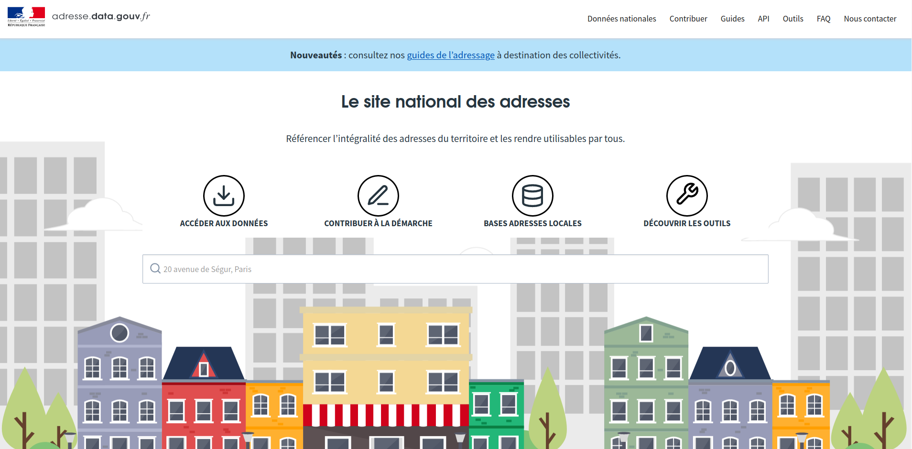](https://adresse.data.gouv.fr/)

---
class: inverse, center, middle

# 8. Mapillary

---
## Mapillary

http://www.villes-internet.net/actions/5bbf52afbb3eab784351e5c5

---
## Mapillary

---
class: inverse, center, middle

# 9. Une appli pour identifier les stations de distribution de GNV

---
## L'appli CarburOGaz

.center[.reduite[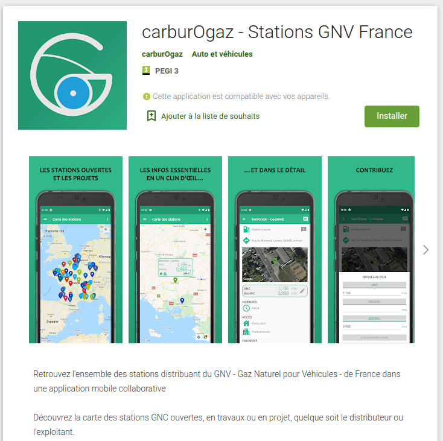]]

---
## L'appli CarburOGaz

.center[.reduite[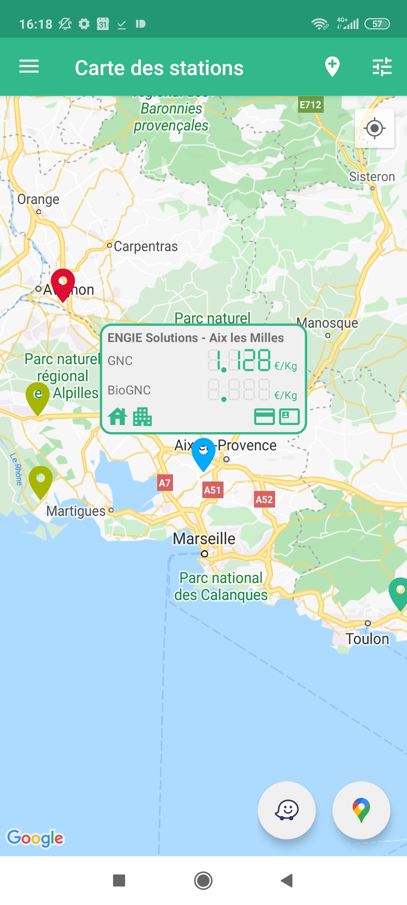]]

---
class: inverse, center, middle

# 10. Et pour finir... des cocktails !

---
## Des recettes de cocktails 

<iframe style="width: 80vw; height: 50vh; border: none;" src="https://query.wikidata.org/embed.html#%23defaultView%3AImageGrid%0ASELECT%20%3Fcocktail%20%3FcocktailLabel%20(SAMPLE(%3Frecipe)%20AS%20%3Frecipe)%20(SAMPLE(%3Fimage)%20AS%20%3Fimage)%0AWHERE%0A%7B%0A%20%20%7B%0A%20%20%20%20SELECT%20%3Fcocktail%20%3FcocktailLabel%20(GROUP_CONCAT(DISTINCT%20%3Fingredient%3B%20separator%3D%22%2C%20%22)%20AS%20%3FingredientsList)%20(GROUP_CONCAT(DISTINCT%20%3FgarnishLabel%3B%20separator%3D%22%2C%20%22)%20AS%20%3FgarnishList)%20(COUNT(DISTINCT%20%3Fingredient)%20%2B%20COUNT(DISTINCT%20%3FgarnishLabel)%20AS%20%3Fcount)%0A%20%20%20%20WHERE%0A%20%20%20%20%7B%0A%20%20%20%20%20%20%3Fcocktail%20wdt%3AP31%2Fwdt%3AP279*%20wd%3AQ134768%3B%0A%20%20%20%20%20%20%20%20%20%20%20%20%20%20%20%20p%3AP186%20%3FmaterialStat.%0A%20%20%20%20%20%20MINUS%20%7B%20%3FmaterialStat%20pq%3AP518%2Fwdt%3AP279*%20wd%3AQ2453629.%20%7D%0A%20%20%20%20%20%20MINUS%20%7B%20%3FmaterialStat%20ps%3AP186%20wd%3AQ488463%3B%20pq%3AP366%20wd%3AQ26876981.%20%7D%0A%20%20%20%20%20%20MINUS%20%7B%20%3FmaterialStat%20pq%3AP366%20wd%3AQ59541.%20%7D%0A%20%20%20%20%20%20%3FmaterialStat%20ps%3AP186%2Frdfs%3Alabel%20%3FmaterialLabel.%0A%20%20%20%20%20%20FILTER(LANG(%3FmaterialLabel)%20%3D%20%22en%22).%0A%20%20%20%20%20%20BIND(%3FmaterialLabel%20AS%20%3FingredientSolo).%0A%20%20%20%20%20%20OPTIONAL%20%7B%0A%20%20%20%20%20%20%20%20%3FmaterialStat%20ps%3AP186%2Frdfs%3Alabel%20%3FmaterialLabel%3B%0A%20%20%20%20%20%20%20%20%20%20%20%20%20%20%20%20%20%20%20%20%20%20pq%3AP1114%20%3Fquantity.%0A%20%20%20%20%20%20%20%20FILTER(LANG(%3FmaterialLabel)%20%3D%20%22en%22).%0A%20%20%20%20%20%20%20%20BIND(CONCAT(STR(%3Fquantity)%2C%20%22%20%22%2C%20%3FmaterialLabel)%20AS%20%3FingredientWithQuantity).%0A%20%20%20%20%20%20%20%20OPTIONAL%20%7B%0A%20%20%20%20%20%20%20%20%20%20%3FmaterialStat%20pq%3AP1114%20%3Fquantity%3B%0A%20%20%20%20%20%20%20%20%20%20%20%20%20%20%20%20%20%20%20%20%20%20%20%20ps%3AP186%2Frdfs%3Alabel%20%3FmaterialLabel%3B%0A%20%20%20%20%20%20%20%20%20%20%20%20%20%20%20%20%20%20%20%20%20%20%20%20pqv%3AP1114%2Fwikibase%3AquantityUnit%20%3Funit.%0A%20%20%20%20%20%20%20%20%20%20FILTER(LANG(%3FmaterialLabel)%20%3D%20%22en%22).%0A%20%20%20%20%20%20%20%20%20%20FILTER(%3Funit%20!%3D%20wd%3AQ199).%0A%20%20%20%20%20%20%20%20%20%20%3Funit%20rdfs%3Alabel%20%3FunitLabel.%0A%20%20%20%20%20%20%20%20%20%20FILTER(LANG(%3FunitLabel)%20%3D%20%22en%22).%0A%20%20%20%20%20%20%20%20%20%20BIND(CONCAT(STR(%3Fquantity)%2C%20%22%20%22%2C%20IF(%3Fquantity%20%3D%201%2C%20%3FunitLabel%2C%20CONCAT(%3FunitLabel%2C%20IF(STRENDS(%3FunitLabel%2C%20%22sh%22)%2C%20%22es%22%2C%20%22s%22)))%2C%20%22%20%22%2C%20%3FmaterialLabel)%20AS%20%3FingredientWithUnit).%0A%20%20%20%20%20%20%20%20%7D%0A%20%20%20%20%20%20%7D%0A%20%20%20%20%20%20BIND(COALESCE(%3FingredientWithUnit%2C%20%3FingredientWithQuantity%2C%20%3FingredientSolo)%20AS%20%3Fingredient).%0A%20%20%20%20%20%20OPTIONAL%20%7B%0A%20%20%20%20%20%20%20%20%3Fcocktail%20p%3AP186%20%5B%20ps%3AP186%20%3Fgarnish%3B%20pq%3AP366%20wd%3AQ59541%20%5D.%0A%20%20%20%20%20%20%20%20%3Fgarnish%20rdfs%3Alabel%20%3FgarnishLabel.%0A%20%20%20%20%20%20%20%20FILTER(LANG(%3FgarnishLabel)%20%3D%20%22en%22).%0A%20%20%20%20%20%20%7D%0A%20%20%20%20%20%20%3Fcocktail%20rdfs%3Alabel%20%3FcocktailLabel.%0A%20%20%20%20%20%20FILTER(LANG(%3FcocktailLabel)%20%3D%20%22en%22).%0A%20%20%20%20%7D%0A%20%20%20%20GROUP%20BY%20%3Fcocktail%20%3FcocktailLabel%0A%20%20%7D%0A%20%20BIND(%0A%20%20%20%20IF(REGEX(%3FingredientsList%2C%20%22%2C%20.*%2C%22)%2C%0A%20%20%20%20%20%20%20REPLACE(%3FingredientsList%2C%20%22(.*)%2C%20(.*)%22%2C%20%22%241%2C%20and%20%242%22)%2C%0A%20%20%20%20%20%20%20REPLACE(%3FingredientsList%2C%20%22(.*)%2C%20(.*)%22%2C%20%22%241%20and%20%242%22))%0A%20%20%20%20AS%20%3Fingredients).%0A%20%20BIND(%0A%20%20%20%20IF(REGEX(%3FgarnishList%2C%20%22%2C%20.*%2C%22)%2C%0A%20%20%20%20%20%20%20REPLACE(%3FgarnishList%2C%20%22(.*)%2C%20(.*)%22%2C%20%22%241%2C%20and%20%242%22)%2C%0A%20%20%20%20%20%20%20REPLACE(%3FgarnishList%2C%20%22(.*)%2C%20(.*)%22%2C%20%22%241%20and%20%242%22))%0A%20%20%20%20AS%20%3Fgarnishes).%0A%20%20OPTIONAL%20%7B%0A%20%20%20%20%3Fcocktail%20p%3AP186%20%5B%20ps%3AP186%20%3Fglass%3B%20pq%3AP518%2Fwdt%3AP279*%20wd%3AQ2453629%20%5D.%0A%20%20%20%20%3Fglass%20rdfs%3Alabel%20%3FglassLabel.%0A%20%20%20%20FILTER(LANG(%3FglassLabel)%20%3D%20%22en%22).%0A%20%20%20%20BIND(IF(REGEX(%3FglassLabel%2C%20%22%5E%5BAEIOUaeiou%5D%22)%2C%20%22an%22%2C%20%22a%22)%20AS%20%3Farticle).%0A%20%20%20%20BIND(CONCAT(%22%20in%20%22%2C%20%3Farticle%2C%20%22%20%22%2C%20%3FglassLabel)%20AS%20%3Fcontainer).%0A%20%20%20%20BIND(%22%2C%20served%22%20AS%20%3Fserved).%0A%20%20%7D%0A%20%20OPTIONAL%20%7B%0A%20%20%20%20%3Fcocktail%20p%3AP186%20%5B%20ps%3AP186%20wd%3AQ488463%3B%20pq%3AP366%20wd%3AQ26876981%20%5D.%0A%20%20%20%20BIND(%22%20on%20the%20rocks%22%20AS%20%3FonTheRocks).%0A%20%20%20%20BIND(%22%2C%20served%22%20AS%20%3Fserved).%0A%20%20%7D%0A%20%20OPTIONAL%20%7B%0A%20%20%20%20FILTER(STRLEN(STR(%3Fgarnishes))%20%3E%201).%0A%20%20%20%20BIND(CONCAT(%22%20with%20%22%2C%20%3Fgarnishes)%20AS%20%3Fgarnish).%0A%20%20%20%20BIND(%22%2C%20served%22%20AS%20%3Fserved).%0A%20%20%7D%0A%20%20BIND(CONCAT(%0A%20%20%20%20%3Fingredients%2C%0A%20%20%20%20COALESCE(%3Fserved%2C%20%22%22)%2C%0A%20%20%20%20COALESCE(%3FonTheRocks%2C%20%22%22)%2C%0A%20%20%20%20COALESCE(%3Fgarnish%2C%20%22%22)%2C%0A%20%20%20%20COALESCE(%3Fcontainer%2C%20%22%22))%0A%20%20%20%20AS%20%3Frecipe).%0A%20%20OPTIONAL%20%7B%20%3Fcocktail%20wdt%3AP18%20%3Fimage.%20%7D%0A%7D%0AGROUP%20BY%20%3Fcocktail%20%3FcocktailLabel%0AORDER%20BY%20DESC(MAX(%3Fcount))" referrerpolicy="origin" sandbox="allow-scripts allow-same-origin allow-popups"></iframe>

---
## Wikidata

[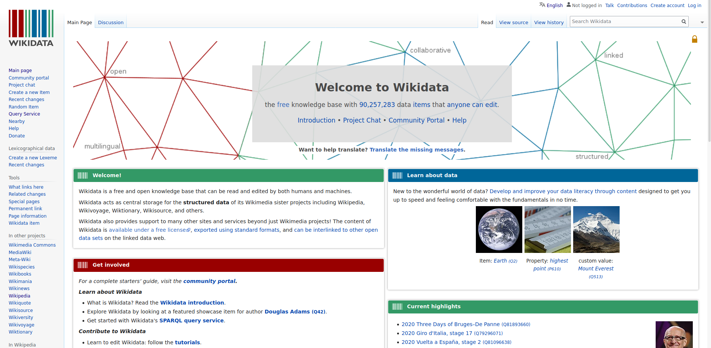](https://www.wikidata.org/)

---
class: inverse, center, middle

# C'est quoi l'open data ?

---
class: inverse, center, middle

# D'abord, c'est quoi les données ?

---
## La pyramide Data-Information-Knowledge-Wisdom

.pull-left[
[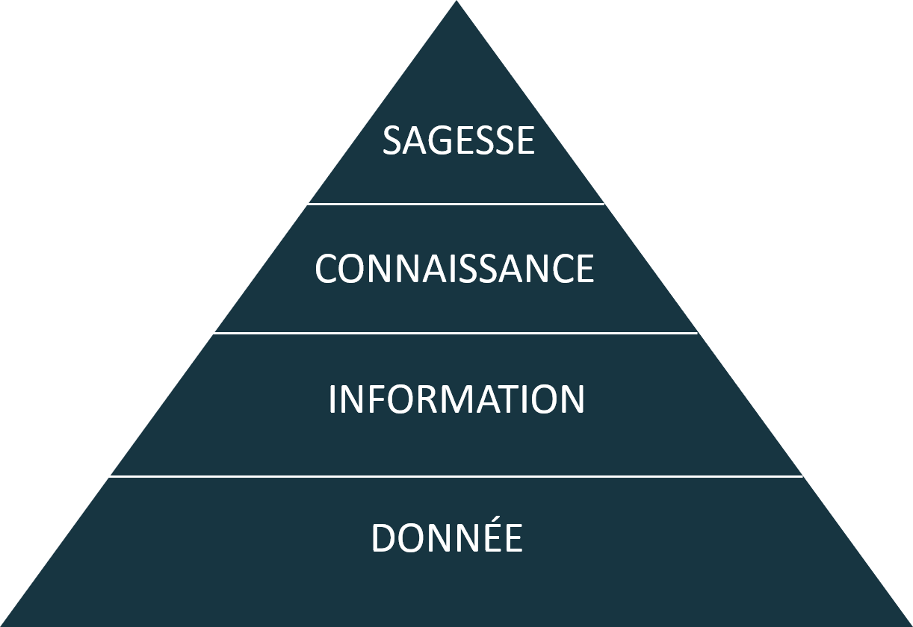](https://commons.wikimedia.org/w/index.php?curid=37705247)
]

.pull-right[Attribuée à [Russell Ackoff](http://en.wikipedia.org/wiki/Russell_L._Ackoff), 1989

Les données peuvent être des :

- faits
- signaux/stimulis
- symboles]

---
## La pyramide Data-Information-Knowledge-Wisdom

- Les **.red[données]** sont la matière "brute" d'où naît l'information.

- **.red[L'information]** pourrait être définie comme des données qui ont été consignées, classées, organisées, raccordées ou interprétées dans un cadre qui en dégage le sens

- En donnant du sens à de l'information, on obtient de la **.red[connaissance]**

- En donnant du sens à la **.red[connaissance]** on obtient du savoir

---
## La mise en données du monde

- Concrètement, aujourd'hui, quels aspects de votre vie sont mis en données ?

--

- Recherches internet, pratiques sportives, consommation énergie, régime alimentaire, trajets dans les transports en commun...

- Cette mise en donnée est rendue possible par le développement de .red[**capteurs**] qui viennent collecter et agréger ces données 

--

- Recherches internet .red[(cookies)], pratiques sportives .red[(montres connectées)], consommation énergie .red[(compteurs connectés)], régime alimentaire .red[(appli type Yuka)], trajets dans les transports en commun .red[(Pass Navigo)]...

- La question devient peut-être, *quels aspects de votre vie ne sont pas (encore) mis en données ?*

---
class: inverse, center, middle

# Et l'open data donc ?

---
## Des données que chacun peut réutiliser librement 

L'open data, ou données ouvertes, ce sont :

- des .red[données]

--

- le plus souvent produites par des acteurs .red[publics]

--

- librement accessibles, modifiables et réutilisables (juridiquement - .red[licences])

--

- effectivement accessibles, modifiables et réutilisables (techniquement - .red[*machine readable*])

*Pour en savoir plus : https://opendefinition.org/od/1.1/fr/*

---
## Un cadre légal spécifique

L'open data se construit comme .red[mouvement international] depuis les années 2000 (Conférence de Sebastopol en 2007). 

En France, le mouvement a commencé au niveau local (Rennes dès 2010) puis a rapidement été repris au niveau national (création de la [mission Etalab](https://www.etalab.gouv.fr/) en 2011). 

En 2016, la .red[Loi pour une République numérique] pose comme principe .red[l'ouverture par principe des données publiques] - en ménageant la .red[protection] de certaines données (personnelles, défense nationale, propriété intellectuelle, secret des affaires, sécurité...). 

Si l'open data est désormais une .red[obligation], c'est avant tout une .red[opportunité] à saisir par les acteurs publics et privés ! 

---
## De l'open data aux données protégées... un large spectre

[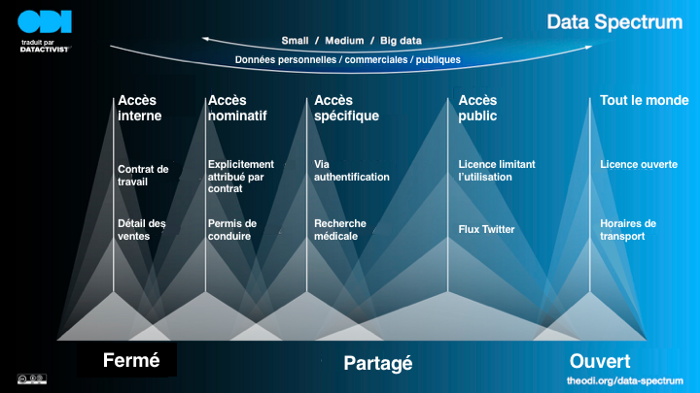](https://medium.com/datactivist/ouvrir-ce-nest-pas-juste-partager-des-donn%C3%A9es-simple-basique-ec87d762f2a2)

---
class: inverse, center, middle

# Merci !

## Vos questions ?

Contact : [joel@datactivist.coop](mailto:joel@datactivist.coop)

